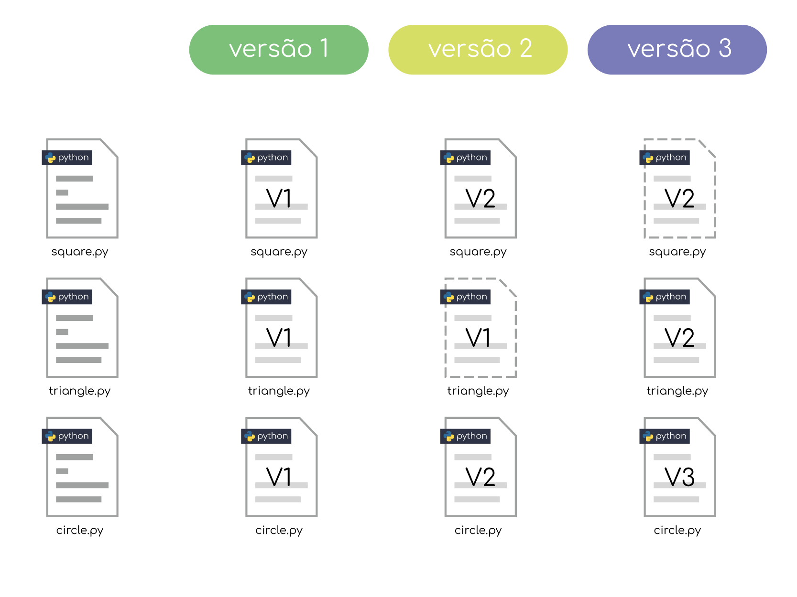
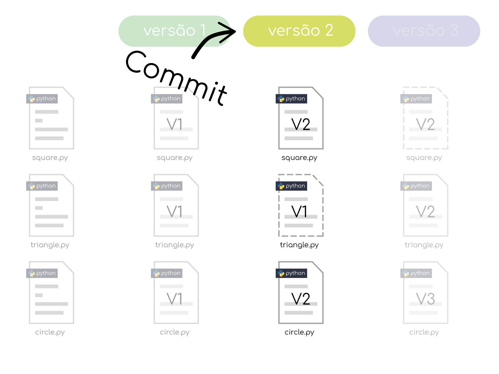
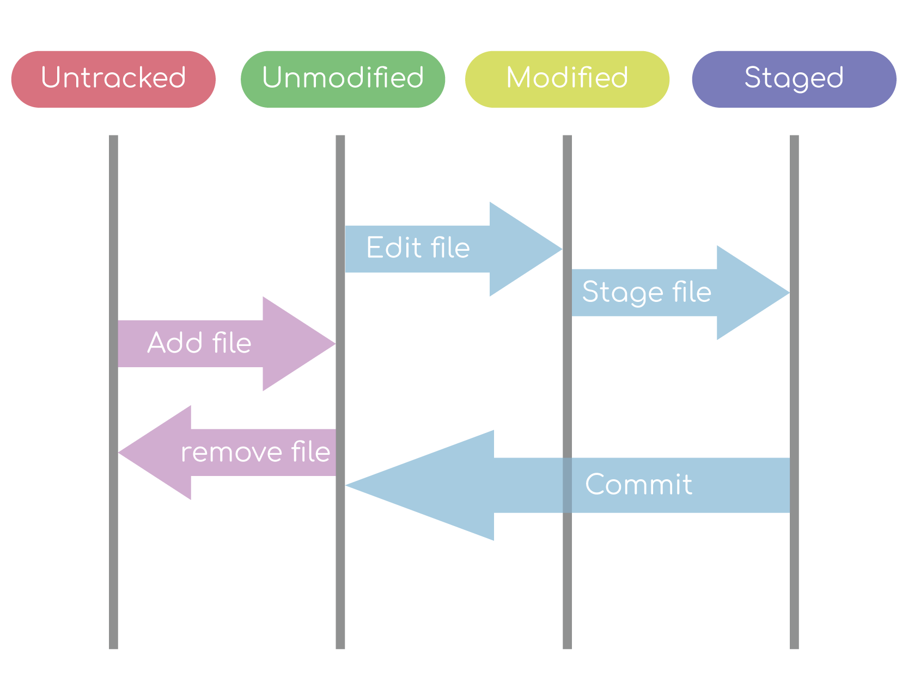
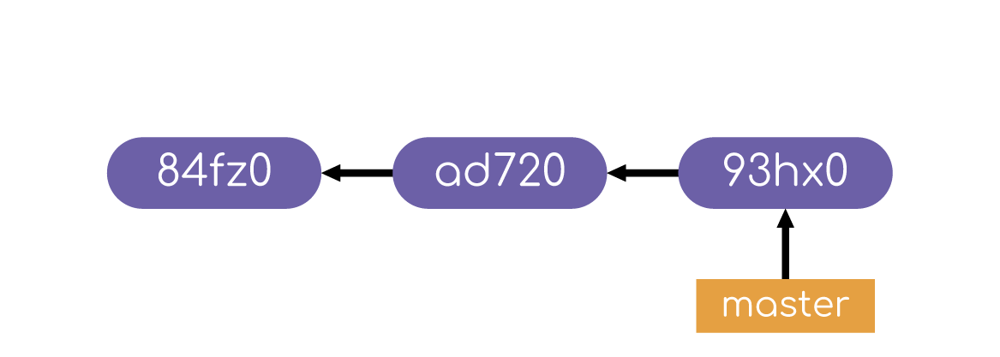
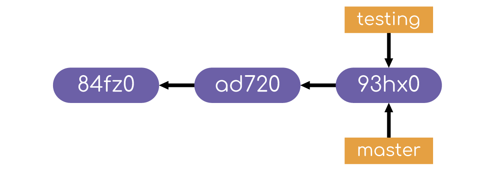
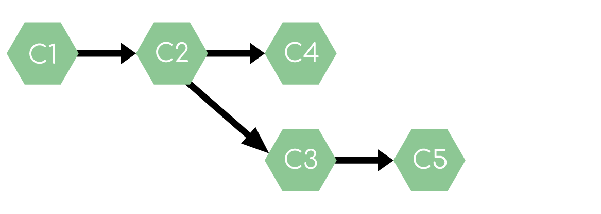
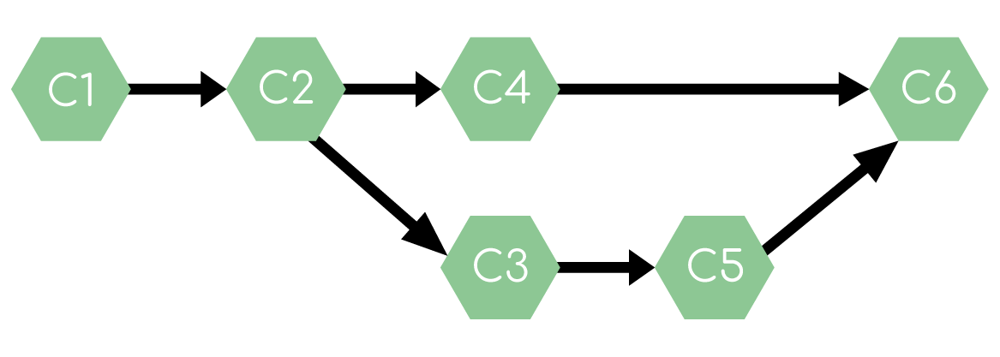
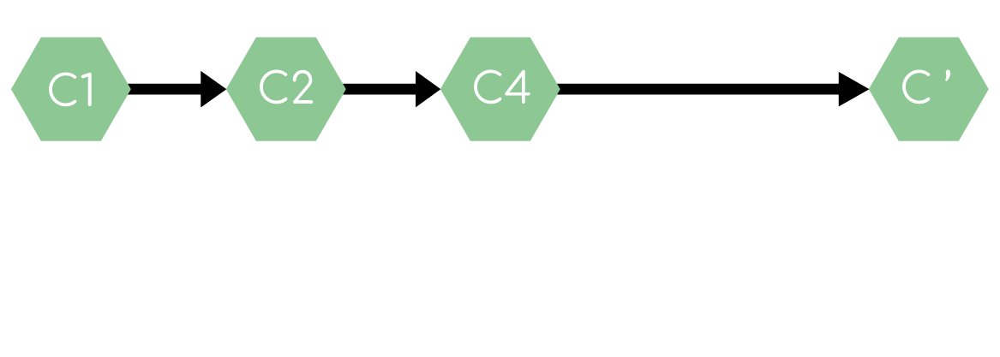

# Git e Github
<p align='center'>
  
</p>
Sejam bem vindos ao material do workshop de git e github. Aqui está a explicação de conceitos do git, comandos que, frequentemente, são utilizados e muito mais.

## Aprenda Antes

Você precisará saber alguns comandos básicos do Terminal Linux para conseguir ter um fluxo de aprendizado interessante no Workshop. Logo, eu deixarei aqui uma lista de comandos e o que eles fazem.

A primeira observação a ser feita é o diretório padrão onde o terminal se localiza ao abri-lo. Abra o terminal e veja que tem algo parecido com `Username@PC_Name:~$`.

O `~` indica o diretório home. É onde, por padrão, o terminal começará.

Para listar as pastas e os arquivos do diretório home, utilize `ls`

Listados os diretórios e arquivos, podemos acessar outras pastas de `~` digitando `cd nome_diretório`. Para voltar, basta escrever `..`

O comando `mkdir nome_pasta` cria uma nova pasta e o `rmdir nome_pasta` deleta a pasta.

Para arquivos, o comando `touch nome_arquivo.extensão_arquivo` cria o arquivo. Enquanto `rm nome_arquivo.extensão_arquivo` deleta.

A título de curiosidade, o comando `rm nome_pasta -rf` é equivalente a `rmdir`. Além disso, não é preciso digitar o nome do arquivo por completo. Ao digitar algumas letras e apertar `TAB`, o terminal completa a palavra na maioria dos casos. Basicamente são esses os comandos necessários para você conseguir prosseguir bem no Workshop de Git.

## Git

<p align='center'>
  
</p>

Git é um controle de versão criado por Linus Torvalds. Mas o que é um controle de versão? É um sistema que grava as diferentes versões dos arquivos de um projeto durante o passar do tempo. Assim o desenvolvedor do sistema pode voltar a versões anteriores, vendo que ocorreu alguma falha ou não gostou da nova implementação no projeto.

Fixado esse conceito, é possível entender melhor o que é o Git.

## Sistema Git

<p align='center'>
  
</p>

O Git funciona com um sistema de snapshots. A cada versão, ele guarda todos os estados de todos os arquivos daquele momento. Por exemplo, na versão 1 foi criado o arquivo square.py e circle.py. Logo o Git irá salvar os estados desses arquivos na primeira versão. Caso seja feito alguma alteração em circle.py, ele guarda o novo estado desse arquivo na versão 2 e cria um link simbólico para o último estado de square.py. Observe que, para casos em que nao foram feitas alterações, ele nao salva de novo o estado do arquivo.

## Commit

<p align='center'>
  
</p>

Um commit é uma versão que guarda os estados de todos os arquivos daquele momento. Esse conceito é muito importante para as próximas explicações. Pois em vez de utilizar a palavra versão, utilizamos commit e seus derivados da língua portuguesa e inglesa. Por exemplo, "Commitar", "Commitou", "Commitado".

## Ciclo de vida dos status dos arquivos

<p align='center'>
  
</p>

Os arquivos, quando gerenciados pelo Git, têm quatro estados:

1. **Untracked**: ocorre quando o arquivo existe no repositório, mas não é reconhecido pelo Git para versionamento.
2. **Unmodified**: é reconhecido pelo Git e não fo alterado do commit anterior ao commit a ser criado.
3. **Modified**: é reconhecido pelo Git e sofreu alterações.
4. **Staged**: foi alterado e está pronto a ser **commitado**.

## Configurar o Git

Precisamos definir alguns dados pessoais. Assim o Git reconhece o autor e o e-mail do criador daquele commit. Além disso, também passa a saber qual editor de texto você utiliza para escrever suas mensagens de commit.

Para definir o nome:
```shellscript
$git config --global user.name "meu_nome"
```

Para definir o e-mail:
```shellscript
$git config --global  user.email "meu_email"
```

Para definir o editor:
```
$git config --global core.editor "comando_do_editor"
```

> Nesse caso, utilizo o [Visual Studio Code](https://code.visualstudio.com/) e o comando para abri-lo no terminal é `code nome_arquivo` ou `code .` para todo o diretório.

Logo a configuração seria:
```
$git config --global core.editor "core --wait"
```

A opção `--wait` é para o Git esperar até que o arquivo de mensagem seja fechado para criar o commit.

Quando você quiser ver as configurações, basta utilizar o comando `git config --list`.

Observe a opção `--global`. Ela usa aquelas configurações a todo projeto Git criado naquela máquina. Para definir configurações ao projeto local, basta utilizar a opção `--local`.

## Iniciando e usando o git

Feita a configuração, agora devemos acessar a pasta em que queremos versionar com o Git e depois utilizar o comando `git init`. Após esse passo, digita-se `git status` e o terminal retorna a uma mensagem dizendo que não tem nenhum commit e nada a enviar ao commit. Quando se cria um arquivo e se digita o mesmo comando, o Git passa a informar que existe um arquivo novo, porém ainda não é reconhecido por ele. Qual o status desse arquivo? Untracked é a resposta correta. Vamos adicioná-lo com o comando `git add nome_arquivo`. E agora, qual o status do arquivo? Se a resposta foi staged, acertou. O arquivo está pronto para ser commitado e, portanto, pode-se criar o commit digitando `git commit -m "mensagem_commit"`.

Veja a opção `-m`. Ela indica que você deve passar uma mensagem ao commit. É sempre bom que essas mensagens sejam algo breve e que indiquem o que foi feito naquela versão. Existem modelos de mensagem de commit e cada empresa escolhe o melhor a seus projetos. Preferindo-se digitar a mensagem em seu editor de texto configurado no início, digita-se `git commit`. Isso abre o editor de texto e quando o arquivo é fechado, o commit será criado.

Criado o commit, agora podemos visualizar a lista de commits com `git log`. Caso deseje filtrar por quantidade, use `git log -número`. Se preferir algo menos poluído, escreva `git log --oneline`. Agora se quiser buscar por autor, digite `git log --author='nome_autor'`. Existem diversas outras opções que podem ser vistas na [documentação](https://git-scm.com/docs/git-log).

Desejando ver quais foram as mudanças feitas naquele commit, escreva `git log` e, a partir daí, aparecem os diversos commits feitos. Todos commits têm um hash(várias letras e números de forma aleatória). Esse hash é importante a realizar algumas operações no Git. Entre elas, ver o que foi alterado naquele commit. Para visualizar as mudanças feitas, basta digitar `git show hash_commit`. Mas como ver as diferenças de um arquivo que está em estado de modified ou staged? É necessário apenas escrever `git diff nome_arquivo`.

## Revertendo

Para entender bem a reversão, é preciso primeiro estar sabendo o ciclo de vida dos status dos arquivos. Revise rapidamente caso não esteja familiarizado.

### Revertendo arquivos adicionado recentemente

Suponha que você criou um arquivo. Agora o status dele é de Untracked. Adiciona-se com o comando `git add nome_arquivo` e, portanto, ele passa a ser conhecido pelo Git, mas ainda não está em nenhuma versão. Para reverter, ou seja, colocá-lo no status de Untracked de novo, basta digitar `git rm --cache nome_arquivo`

### Revertendo arquivos em status de modified

Suponha agora que um arquivo está em status de modified. Olhando-se as alterações feita nele com `git diff nome_arquivo` e não as aprovando. Para reverter, basta escrever `git checkout nome_arquivo`.

### Revertendo arquivos em status de staged

Agora seu arquivo está pronto a ser commitado. Se Você verifica com `git diff nome_arquivo` e não gosta das alterações feitas, volta digitando `git reset HEAD nome_arquivo`. Feito isso, o arquivo volta ao status de modified e assim pode ser usado o comando da seção acima.

## Revertendo Commit

Existem três formas de reverter um commit:

1. `--soft`: O commit é desfeito e os arquivos passam ao status de staged.
2. `--mixed`: O commit é desfeito e os arquivos passam ao status de modified.
3. `--hard`: O commit é eliminado.

Para desfazer um commit, digite `git reset [--soft|--mixed|--hard] hash_commit_anterior`.

**Obs**.: Não é recomendado utilizar o `--hard`, pois isso faz com que o commit seja deletado e todas as alterações feitas nele sejam perdidas para sempre. Tenha bastante certeza do que quer fazer ao utilizá-lo.

## Branch

Um branch é um ponteiro móvel para um commit. Ele permite que sejam trabalhadas novas features, correções de bug, etc em paralelo ao desenvolvimento principal. Isso possibilita um melhor fluxo do trabalho em equipe.

O comando `git branch nome_branch` cria um novo branch. Para listar os branchs criados, digite `git branch`. Já `git branch -D nome_branch` deleta o branch. Para mudar de branch, escreva `git checkout nome_branch_destino`.

<p align='center'>
  
</p>

<p align='center'>
  
</p>

Veja que o trabalho desenvolvido em cada branch é distinto. Ou seja, caso seja realizado um commit no branch `testing` e depois mudado ao branch `master`, o commit criado em `testing` não pode estar no branch `master`. Então o comando `git checkout testing` realiza duas operações:

1. Muda para o branch `testing`
2. Carrega as mudanças daquele branch e remove as feitas apenas no branch `master`.

## Merge e Rebase

<p align='center'>
  
</p>

Agora como juntar os commits de um branch com outro? Existem o `merge` e o `rebase`. Os dois chegam ao mesmo objetivo, porém com abordagens diferentes.

O `merge` cria um novo commit. Esse commit contém commits do branch merged não feitos no branch atual e vice-versa. A vantagem de utilizá-lo é que ele nao desorganiza o histórico, mas sua desvantagem é criar um novo commit apenas para juntar as alterações de um branch com o outro.

<p align='center'>
  
</p>

Já o `rebase` move todos os commits feitos no branch rebased à frente do branch atual. A vantagem de utilizá-lo é o fato de que ele nao cria um novo commit, porém ele quebra a ordem cronológica dos commits, já que os move à frente.

<p align='center'>
  
</p>

Suponha que no branch `testing` foram feitas alterações e elas foram commitadas. Agora você muda para o branch `master` e decide criar um merge dos dois branchs. Para fazer isso, digite `git merge testing`. Em uma situação em que se prefira o rebase, basta digitar `git rebase testing`. Baseado nesse conhecimento, deve se pensar qual a melhor abordagem a cada caso.

## Referências

[Curso de Git na Udemy](https://www.udemy.com/git-e-github-para-iniciantes/)  
[Documentação do Git](https://git-scm.com/docs)  
[ProGit Book](https://git-scm.com/book/en/v2)  
